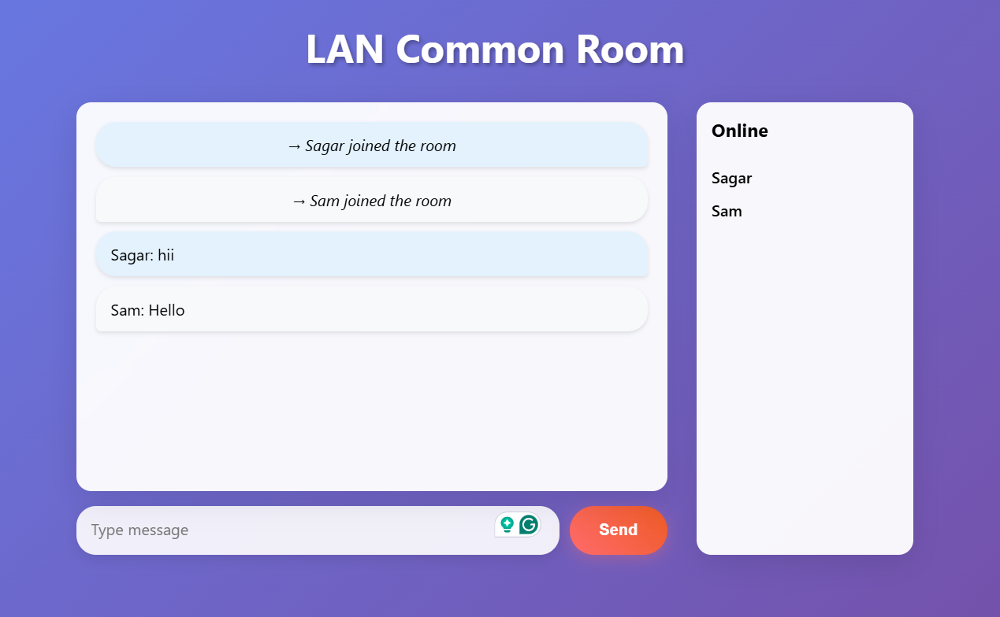

# LAN Chat Application

A simple real-time LAN (Local Area Network) chat application built using Node.js and WebSockets. This application allows users on the same WiFi network to communicate with each other through a web interface - no internet connection required.

## 📸 UI - Screenshot


## 🚀 Features

- Real-time messaging using WebSockets
- User join/leave system notifications
- Online users list (side panel)
- Clean and simple user interface
- Works entirely over local Wi-Fi (LAN)
- No external dependencies for clients

## 🛠️ Tech Stack
- Backend: Node.js with `ws` WebSocket library
- Frontend: HTML, CSS, JavaScript
- Transport: HTTP + WebSockets

## 📦 Prerequisites

- Node.js (version 14 or higher)
Check Node.js installation: 

```bash
node -v
npm -v
```

## 📥 Installation

1. Clone or download this repository
```bash
git clone https://github.com/SagarDas07/lan-chat.git
```
2. Navigate to the project directory:

```bash
cd lan-chatj
```

3. Install dependencies:

```bash
npm install
```

## ▶️ Running the Application

Start the server:

```bash
node server.js
```

The chat will be available at `http://localhost:3000` on your local machine. To access it from other devices on the same WiFi network, use your machine's IP address instead of `localhost`.

### 🔍 Finding Your IP Address

- **Windows**: Open Command Prompt and run `ipconfig`. Look for "IPv4 Address" under your network adapter (usually something like 192.168.1.xxx).
- **macOS/Linux**: Open Terminal and run `ifconfig` or `ip addr show`. Look for your local IP (e.g., 192.168.1.xxx).

Example: If your IP is `192.168.1.100`, the chat room will be available at `http://192.168.1.100:3000`.

## 💬 Usage

1. Start the server on one device (the host)
2. On any device connected to the same WiFi network (phones, tablets, other computers), open a web browser and navigate to the host's IP address with port 3000 (e.g., `http://192.168.1.100:3000`)
3. Enter your name when prompted
4. Start chatting!


## 📁 Project Structure

```lan-chat/
├── assets/
│   └── screenshot.png  # Screenshot of the chat UI
├── server.js        # Node.js server & WebSocket logic
├── index.html       # Main HTML page
├── chat.js          # Client-side chat logic
├── style.css        # UI styling
├── package.json     # Project metadata & dependencies
├── package-lock.json
├── .gitignore
└── README.md
```

## 📜 License

This project is licensed under the ISC License.

## 🙏 Acknowledgements
Built as a hands-on learning project to understand:
- WebSockets
- Real-time systems
- LAN-based communication
- Client–server architecture